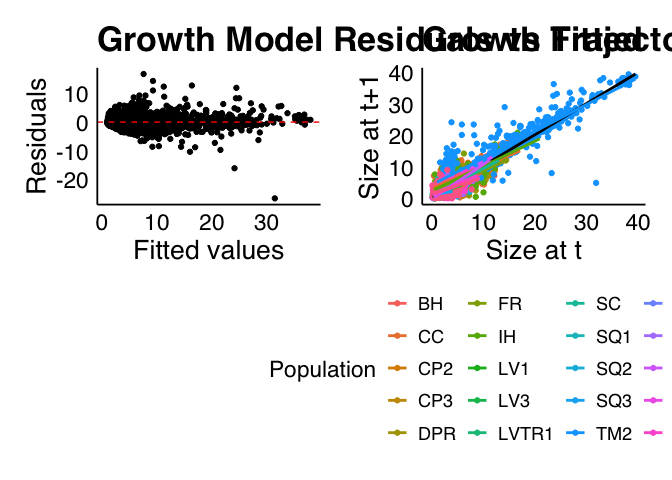
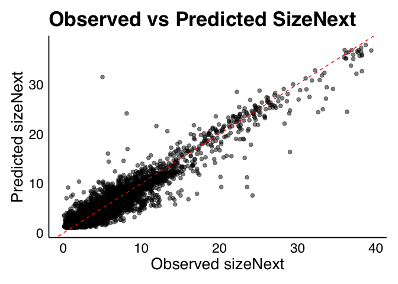
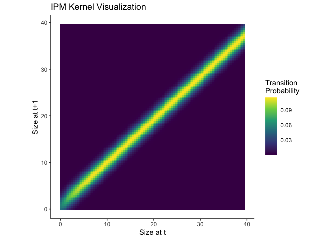

# Data load and wrangling

First load some libraries

    library(tidyverse)
    library(ggthemes)
    library(ggdoctheme)
    library(lme4)
    library(lmerTest)
    library(ggpubr)
    library(ggrepel)
    library(patchwork)
    knitr::opts_chunk$set(warning = FALSE, message = FALSE) 

Now load the data

    height_file = "data/WL2-2023_Size_Combined.csv"
    mortality_file = "data/WL2_Mortality.csv"

    heights = read_csv(height_file) |>
    filter(parent.pop != "WV")
      
    mortality = read_csv(mortality_file) |>
    filter(parent.pop != "WV") |>
        mutate(death.date = as.Date(death.date, format = "%m/%d/%y"))

Wrangling the data. First process height data to get consecutive
measurements

    size_data = heights |>
        arrange(Genotype, survey_date) |>
        group_by(parent.pop, Genotype) |>
        mutate(
          sizeNext = lead(height.cm),
          dateNext = lead(survey_date)
        ) |>
        filter(!is.na(height.cm)) |>
        select(Genotype, survey_date, dateNext, height.cm, sizeNext, parent.pop)

Next we process mortality data and also write the tsv file

      survival_data = size_data |>
        left_join(
          mortality |> select(Genotype, death.date),
          by = "Genotype"
        ) |>
        mutate(
          survival = case_when(
            is.na(death.date) ~ 1,
            death.date > dateNext ~ 1,
            death.date >= survey_date & death.date <= dateNext ~ 0,
            TRUE ~ 1
          )
        ) |>
        select(Genotype, survey_date, size = height.cm, sizeNext, survival, population = parent.pop)
    write_tsv(survival_data, "data/survival_data.tsv")

Now let’s define some models and compare them:

    formulas = list(
      # Basic model
        sizeNext ~ size + (size | population),
        # Model with survey date
        sizeNext ~ size + (size | population) + (1|survey_date),
        # Model with temporal effects
        sizeNext ~ size + poly(as.numeric(survey_date), 2) + 
        (size | population) + (as.numeric(survey_date) | population),
        # Model with quadratic size
        sizeNext ~ size + poly(size,2) + (size | population) + (1|survey_date)
    )

Create a function to compare models

    compare_mixed_models = function(formula_list, data, verbose = TRUE) {
      
      # Create empty lists to store results
      models = list()
      summaries = list()
      fit_stats = data.frame(
        Model = character(),
        AIC = numeric(),
        BIC = numeric(),
        logLik = numeric(),
        deviance = numeric(),
        df.residual = numeric(),
        stringsAsFactors = FALSE
    )
      
      # Fit each model and collect results
      for (i in seq_along(formula_list)) {
        model_name = paste("Model", i)
        
        # Fit the model with error handling
        tryCatch({
          # Fit model
          models[[model_name]] = lmer(formula_list[[i]], data = data)
          
          # Store summary
          summaries[[model_name]] = summary(models[[model_name]])
          
          # Collect fit statistics
          fit_stats = rbind(fit_stats, data.frame(
            Model = model_name,
            AIC = AIC(models[[model_name]]),
            BIC = BIC(models[[model_name]]),
            logLik = as.numeric(logLik(models[[model_name]])),
            deviance = deviance(models[[model_name]]),
            df.residual = df.residual(models[[model_name]])
          ))
          
        }, error = function(e) {
          warning(paste("Error in fitting", model_name, ":", e$message))
        })
      }
      
      # Calculate delta AIC and AIC weights

        fit_stats = fit_stats |>
            mutate(deltaAIC = AIC - min(AIC)) |>
            mutate(AICweight = exp(-0.5 * deltaAIC) / sum(exp(-0.5 * deltaAIC))) |>
            arrange(AIC)
      
      # Return results as a list
      return(list(
        models = models,
        summaries = summaries,
        fit_statistics = fit_stats
      ))
    }

Now let’s compare and view models

    model_comparison = compare_mixed_models(formulas, survival_data)

    print(model_comparison$fit_statistics)

    ##     Model      AIC      BIC    logLik deviance df.residual  deltaAIC
    ## 1 Model 4 24411.23 24466.02 -12197.61 24395.23        6956   0.00000
    ## 2 Model 2 24446.84 24494.78 -12216.42 24432.84        6957  35.60692
    ## 3 Model 3 24674.80 24750.13 -12326.40 24652.80        6953 263.56703
    ## 4 Model 1 25371.63 25412.72 -12679.82 25359.63        6958 960.40233
    ##       AICweight
    ## 1  1.000000e+00
    ## 2  1.853769e-08
    ## 3  5.849885e-58
    ## 4 2.826722e-209

    best_model = model_comparison$models[[1]]  # First model in list

With all the noisy data, it would be difficult to quantitatively compare
the models, and we might risk overfitting.

Let’s visualize the model

    growth_resid = residuals(best_model)
    growth_fitted = fitted(best_model)
      
    growth_diag = ggplot() +
    geom_point(aes(x = growth_fitted, y = growth_resid)) +
    geom_hline(yintercept = 0, linetype = "dashed", color = "red") +
    labs(x = "Fitted values", y = "Residuals",
            title = "Growth Model Residuals vs Fitted") +
    theme_doc()

    size_trajectory = ggplot(survival_data) +
    geom_point(aes(x = size, y = sizeNext, color = population)) +
    geom_smooth(aes(x = size, y = sizeNext), se = FALSE, method = "lm", color = "black") +
    geom_smooth(aes(x = size, y = sizeNext, color = population), method = "lm", se = FALSE) +
    labs(x = "Size at t", y = "Size at t+1",
            title = "Growth Trajectories by Population",
            colour = "Population") +
    theme_doc()

    growth_diag + size_trajectory

    predicted_data = data.frame(sizeNext = survival_data$sizeNext,
    pred_sizeNext = predict(best_model, newdata = survival_data))

    predicted_data |>
    ggplot(aes(x = sizeNext, y = pred_sizeNext)) +
    geom_point(size = 2, alpha = 0.5) +
    geom_abline(intercept = 0, slope = 1, linetype = "dashed", color = "red") +
    labs(x = "Observed sizeNext", y = "Predicted sizeNext",
            title = "Observed vs Predicted SizeNext") +
    theme_doc()

Residuals vs fitted plot shows that the residuals are not particularly
normally distributed. But perhaps we can still use the model to make
predictions.

Now let’s move on to the survival predictions.

First let’s define some models.

    formulas_survival = list(
      # Basic model
        survival ~ size + (size | population),
        # Model with survey date
        survival ~ size + (size | population) + (1|survey_date),
        # Model with quadratic size
        survival ~ size + poly(size,2) + (size | population) + (1|survey_date),
        # Model with cubic size
        survival ~ size + poly(size,3) + (size | population) + (1|survey_date),
        # Model with cubic size but no survey date
        survival ~ size + poly(size,3) + (size | population)
    )

    compare_survival_models = function(formula_list, data, verbose = TRUE) {
      
      # Create empty lists to store results
      models = list()
      summaries = list()
      fit_stats = data.frame(
        Model = character(),
        AIC = numeric(),
        BIC = numeric(),
        logLik = numeric(),
        deviance = numeric(),
        df.residual = numeric(),
        stringsAsFactors = FALSE
    )
      
      # Fit each model and collect results
      for (i in seq_along(formula_list)) {
        model_name = paste("Model", i)
        
        # Fit the model with error handling
        tryCatch({
          # Fit model
          models[[model_name]] = glmer(formula_list[[i]], family = binomial(), data = data)
          
          # Store summary
          summaries[[model_name]] = summary(models[[model_name]])
          
          # Collect fit statistics
          fit_stats = rbind(fit_stats, data.frame(
            Model = model_name,
            AIC = AIC(models[[model_name]]),
            BIC = BIC(models[[model_name]]),
            logLik = as.numeric(logLik(models[[model_name]])),
            deviance = deviance(models[[model_name]]),
            df.residual = df.residual(models[[model_name]])
          ))
          
        }, error = function(e) {
          warning(paste("Error in fitting", model_name, ":", e$message))
        })
      }
      
      # Calculate delta AIC and AIC weights

        fit_stats = fit_stats |>
            mutate(deltaAIC = AIC - min(AIC)) |>
            mutate(AICweight = exp(-0.5 * deltaAIC) / sum(exp(-0.5 * deltaAIC))) |>
            arrange(AIC)
      
      # Return results as a list
      return(list(
        models = models,
        summaries = summaries,
        fit_statistics = fit_stats
      ))
    }

Now let’s compare and view models

    model_comparison = compare_survival_models(formulas_survival, survival_data)

    print(model_comparison$fit_statistics)

    ##     Model      AIC      BIC    logLik deviance df.residual  deltaAIC
    ## 1 Model 4 5160.132 5216.593 -2572.066 5019.902        8575   0.00000
    ## 2 Model 2 5171.579 5213.924 -2579.790 5001.140        8577  11.44679
    ## 3 Model 3 5185.794 5235.197 -2585.897 5046.880        8576  25.66210
    ## 4 Model 5 5733.008 5782.410 -2859.504 5622.241        8576 572.87521
    ## 5 Model 1 5739.021 5774.309 -2864.511 5621.859        8578 578.88881
    ##       AICweight
    ## 1  9.967394e-01
    ## 2  3.257942e-03
    ## 3  2.667635e-06
    ## 4 3.983918e-125
    ## 5 1.970031e-126

    best_model_survival = model_comparison$models[[1]]  # First model in list

Seems like cubic size model with survey date is the best model.

Let’s visualize the model

    predicted_survival_data = data.frame(survival = survival_data$survival,
    pred_survival = predict(best_model_survival, newdata = survival_data, type = "response"))

    predicted_survival_data |>
    ggplot(aes(x = factor(survival), y = pred_survival)) +
    geom_boxplot(outlier.shape = NA)+
    geom_jitter(width = 0.1, height = 0.1, alpha = 0.5) +
    labs(x = "Observed Survival", y = "Predicted Survival",
         title = "Observed vs Predicted Survival") +
    theme_doc()

The predicted median probablity of death is around 0.7+ which is not
particularly good. But we can still use the model to make predictions.

Now let’s move on to the next step and make the kernel with the
functions.

    fit_hierarchical_growth = function(data) {
      # Fit hierarchical growth model using lme4
      growth_model = lmer(sizeNext ~ size + poly(size,2) + (size | population) + (1|survey_date),
        data = data
    )
      
      return(growth_model)
    }

    # Function to fit hierarchical survival model
    fit_hierarchical_survival = function(data) {
      # Fit hierarchical survival model
      survival_model = glmer(
        survival ~ size + poly(size,3) + (size | population),
        family = binomial(),
        data = data
      )
      
      return(survival_model)
    }

Define the fuction to make the P matrix

    construct_global_kernel = function(growth_model, survival_model, 
      mesh_points = 100, 
      min_size = NULL, 
      max_size = NULL) {
      # If size bounds not provided, estimate from the data
      if (is.null(min_size)) min_size = min(growth_model@frame$size)
      if (is.null(max_size)) max_size = max(growth_model@frame$size)
      
      # Create mesh points for integration
      mesh = seq(min_size, max_size, length.out = mesh_points)
      h = diff(mesh[1:2])  # Step size for midpoint rule
      
      # Create matrices to store kernels
      P = matrix(0, mesh_points, mesh_points)  # Growth-survival kernel
      
      # Get fixed effects for growth
      b_growth = fixef(growth_model)
      
      # Get fixed effects for survival
      b_survival = fixef(survival_model)
      
      # Construct kernel
      for (i in 1:mesh_points) {
        # Current size
        z = mesh[i]
        
        # Predict mean sizeNext
        mu_growth = b_growth[1] + b_growth[2] * z
        
        # Calculate survival probability
        s = plogis(b_survival[1] + b_survival[2] * z)
        
        # Normal density for growth
        growth_density = dnorm(mesh, mu_growth, sqrt(sigma(growth_model)^2))
        
        # Combine survival and growth
        P[,i] <- s * growth_density * h
      }
      
      return(list(
        P = P,
        mesh = mesh,
        h = h
      ))
    }

Now let’s make the P matrix using the kernels

    growth_fit = fit_hierarchical_growth(survival_data)
    survival_fit = fit_hierarchical_survival(survival_data)

    global_kernel = construct_global_kernel(
    growth_fit, 
    survival_fit
    )

Now let’s visualize the P matrix

    kernel = global_kernel$P
    mesh = global_kernel$mesh

    kernel_df = expand.grid(
        size_next = mesh,
        size = mesh
      )
    kernel_df$density = as.vector(kernel)
      
    ggplot(kernel_df, aes(x = size, y = size_next, fill = density)) +
    geom_tile() +
    scale_fill_viridis_c() +
    labs(x = "Size at t",
            y = "Size at t+1",
            fill = "Transition\nProbability",
            title = "IPM Kernel Visualization") +
    theme_classic() +
    coord_equal()

