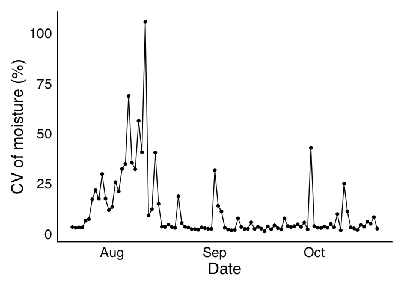
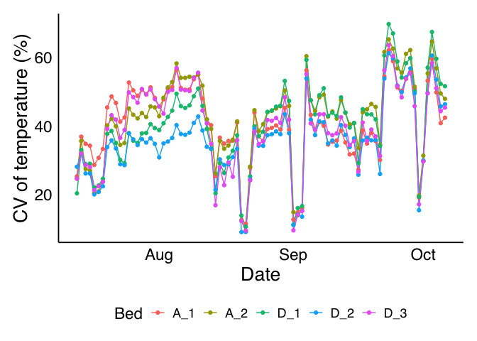
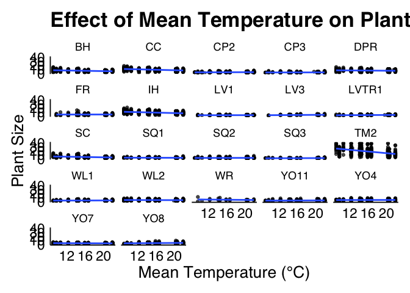
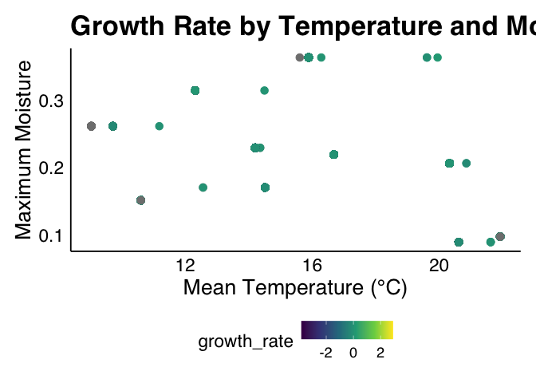
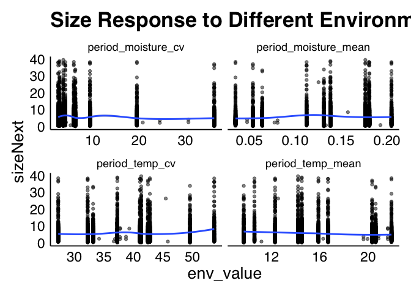
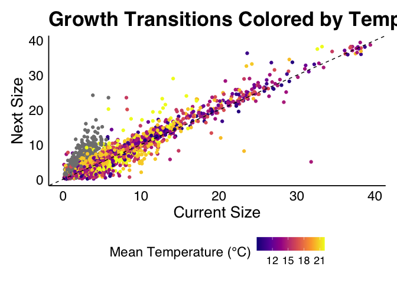
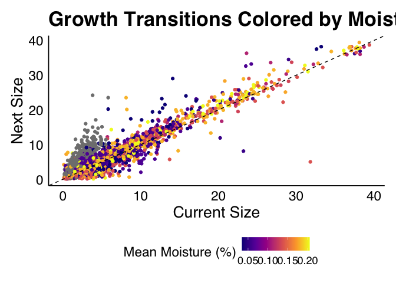
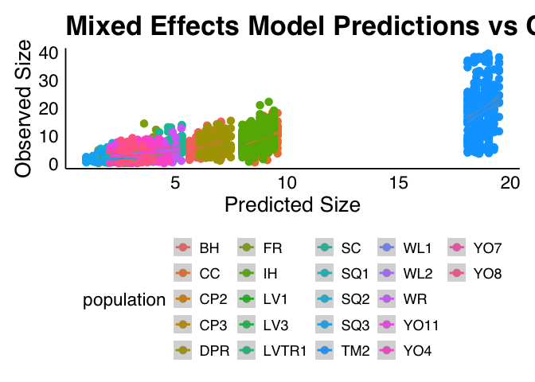
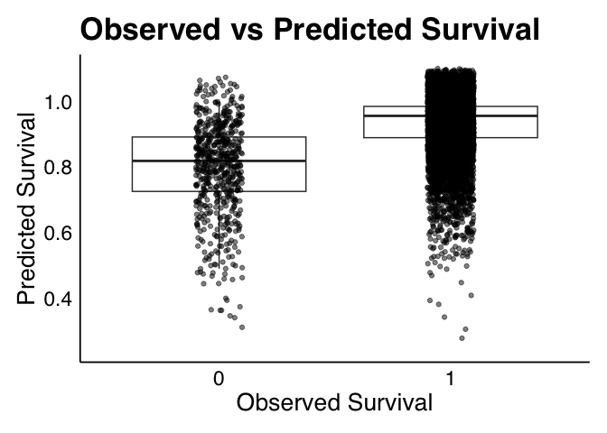

# Data load and wrangling the temperature and moisture data to the main data

First load some libraries

    library(tidyverse)

    ## Warning: package 'ggplot2' was built under R version 4.2.3

    library(ggthemes)
    library(ggdoctheme)
    library(lme4)
    library(lmerTest)
    library(ggpubr)
    library(ggrepel)
    library(patchwork)
    library(lubridate)
    knitr::opts_chunk$set(warning = FALSE, message = FALSE)
    select = dplyr::select

Now load the data

    data = read_tsv("data/survival_data.tsv")
    temp_data = read_csv("data/WL2_2022_2023_iButton_Data_Corrected.csv") |>
    mutate(datetime_obj = mdy_hm(Date_Time)) |>
    mutate(date = as_date(datetime_obj), time = format(datetime_obj, "%H:%M")) |>
    filter(date > as.Date("2023-07-06")) |>
    select(Bed, date, time, SoilTemp,)

    moisture_data = read_csv("data/WL2_2023_Bed_C_Soil_Moisture_Corrected.csv") |>
    mutate(datetime_obj = mdy_hm(Date_Time)) |>
    mutate(date = as_date(datetime_obj), time = format(datetime_obj, "%H:%M")) |>
    filter(date > as.Date("2023-07-06")) |>
    select(date, time, Port_1:Port_5)

Take the mean of the 5 ports from the moisture sensor data and summarize
to daily with max and min

    mean_moisture = moisture_data |>
    rowwise() |>
    mutate(moisture_avg = mean(Port_1:Port_5, na.rm = TRUE)) |>
    select(date, time, moisture_avg)

    daily_moisture = mean_moisture |>
    ungroup() |>
    group_by(date) |>
    summarize(moisture_max = max(moisture_avg, na.rm = TRUE), moisture_min = min(moisture_avg, na.rm = TRUE), 
    mean_moisture = mean(moisture_avg, na.rm = TRUE), moisture_cv = sd(moisture_avg, na.rm = TRUE)/mean(moisture_avg, na.rm = TRUE)*100)

Make some plots to see the CV over time

    daily_moisture |>
    ggplot(aes(x = date, y = moisture_cv, group = 1)) +
    geom_line() +
    geom_point() +
    theme_doc()+
    labs(x = "Date", y = "CV of moisture (%)")

Perform the same with soil temperature data

    daily_temp = temp_data |>
    group_by(Bed, date) |>
    summarize(temp_max = max(SoilTemp, na.rm = TRUE), temp_min = min(SoilTemp, na.rm = TRUE),
    mean_temp = mean(SoilTemp, na.rm = TRUE), temp_cv = sd(SoilTemp, na.rm = TRUE)/mean(SoilTemp, na.rm = TRUE)*100)

Visualize the CV by bed

    daily_temp |>
    ggplot(aes(x = date, y = temp_cv, group = Bed, color = Bed)) +
    geom_line() +
    geom_point() +
    theme_doc()+
    labs(x = "Date", y = "CV of temperature (%)")

Join the temperature and moisture data together to make things easier.
Also, I am going to take the mean of all the beds

    daily_temp_moisture = left_join(daily_temp |> 
    ungroup() |> 
    group_by(date) |> 
    summarize(mean_temp = mean(mean_temp, na.rm = TRUE),
    mean_cv = mean(temp_cv, na.rm = TRUE),
    temp_max = max(temp_max, na.rm = TRUE), temp_min = min(temp_min)),
    daily_moisture, by = "date")

Now let’s join the two data, by aggregating the daily data to weekly by
anchoring it each day Already ran, so just load it.

    size_data_with_intervals = data |>
        arrange(Genotype, survey_date) |>
        group_by(Genotype) |>
        mutate(
          prev_survey_date = lag(survey_date),
          # If it's the first measurement for a Genotype, use 7 days as default lookback
          lookback_start = if_else(is.na(prev_survey_date), 
                                   survey_date - days(7), 
                                   prev_survey_date + days(1)),
          lookback_end = survey_date
        ) |>
        ungroup()
      
    # Join the data with intervals

    combined_data = size_data_with_intervals |>
        rowwise() |>
        mutate(
          # Filter environmental data for the specific interval
          matching_env_data = list(
            daily_temp_moisture |>
              filter(date >= lookback_start, date <= lookback_end)
          ),
          # Count how many env observations we have for this period
          env_obs_count = nrow(matching_env_data),
          # Calculate aggregates
          period_temp_mean = mean(matching_env_data$mean_temp, na.rm = TRUE),
          period_temp_cv = mean(matching_env_data$mean_cv, na.rm = TRUE),
          period_temp_max = max(matching_env_data$temp_max, na.rm = TRUE),
          period_temp_min = min(matching_env_data$temp_min, na.rm = TRUE),
          period_moisture_max = max(matching_env_data$moisture_max, na.rm = TRUE),
          period_moisture_min = min(matching_env_data$moisture_min, na.rm = TRUE),
          period_moisture_mean = mean(matching_env_data$mean_moisture, na.rm = TRUE),
          period_moisture_cv = mean(matching_env_data$moisture_cv, na.rm = TRUE)
        ) |>
        # Clean up intermediate columns
        select(-matching_env_data) |>
        ungroup()

    #write_tsv(combined_data, "data/combined_data.tsv")
    combined_data = read_tsv("data/combined_data.tsv")

Now visualize the mean temperature vs size by population

    ggplot(combined_data, aes(x = period_temp_mean, y = size)) +
      geom_point(alpha = 0.7) +
      geom_smooth(method = "lm", se = TRUE) +
      facet_wrap(~ population) +
      theme_doc() +
      labs(title = "Effect of Mean Temperature on Plant Size",
           x = "Mean Temperature (°C)", y = "Plant Size")

Heatmap of growth rate vs environmental variables

    # First calculate growth rate
    grate = combined_data |>
      group_by(Genotype) |>
      mutate(growth_rate = (sizeNext - size)/7) |>
      ungroup()
      
    # Then plot heatmap
    ggplot(grate, aes(x = period_temp_mean, y = period_moisture_max, color = growth_rate)) +
      geom_point(size = 3) +
      scale_color_viridis_c() +
      theme_doc()+
      labs(title = "Growth Rate by Temperature and Moisture",
           x = "Mean Temperature (°C)", y = "Maximum Moisture")

    # Create long format for environmental variables
    env_long = combined_data |>
      pivot_longer(
        cols = c(period_temp_mean, period_temp_cv, period_moisture_mean, period_moisture_cv),
        names_to = "env_variable",
        values_to = "env_value"
      )
      
    ggplot(env_long, aes(x = env_value, y = sizeNext)) +
      geom_point(alpha = 0.5) +
      geom_smooth(method = "loess") +
      facet_wrap(~ env_variable, scales = "free_x") +
      theme_doc()+
      labs(title = "Size Response to Different Environmental Variables")

    ggplot(combined_data, aes(x = size, y = sizeNext, color = period_temp_mean)) +
      geom_point() +
      geom_abline(slope = 1, intercept = 0, linetype = "dashed") +
      scale_color_viridis_c(option = "plasma") +
      theme_doc()+
      labs(title = "Growth Transitions Colored by Temperature",
           x = "Current Size", y = "Next Size", colour = "Mean Temperature (°C)")

    ggplot(combined_data, aes(x = size, y = sizeNext, color = period_moisture_mean)) +
      geom_point() +
      geom_abline(slope = 1, intercept = 0, linetype = "dashed") +
      scale_color_viridis_c(option = "plasma") +
      theme_doc()+
      labs(title = "Growth Transitions Colored by Moisture %",
           x = "Current Size", y = "Next Size", colour = "Mean Moisture (%)")

library(lme4)

    # Fit a simple mixed model
    model = lmer(sizeNext ~ period_temp_cv + period_moisture_cv + (1|population), data = combined_data)
    summary(model)

    ## Linear mixed model fit by REML. t-tests use Satterthwaite's method [
    ## lmerModLmerTest]
    ## Formula: sizeNext ~ period_temp_cv + period_moisture_cv + (1 | population)
    ##    Data: combined_data
    ## 
    ## REML criterion at convergence: 29087.5
    ## 
    ## Scaled residuals: 
    ##     Min      1Q  Median      3Q     Max 
    ## -5.4389 -0.4318 -0.0417  0.3811  7.2345 
    ## 
    ## Random effects:
    ##  Groups     Name        Variance Std.Dev.
    ##  population (Intercept) 14.167   3.764   
    ##  Residual                7.946   2.819   
    ## Number of obs: 5894, groups:  population, 22
    ## 
    ## Fixed effects:
    ##                      Estimate Std. Error         df t value Pr(>|t|)    
    ## (Intercept)         3.276e+00  8.326e-01  2.424e+01   3.935 0.000612 ***
    ## period_temp_cv      4.018e-02  5.853e-03  5.870e+03   6.865 7.31e-12 ***
    ## period_moisture_cv -2.990e-02  3.612e-03  5.870e+03  -8.279  < 2e-16 ***
    ## ---
    ## Signif. codes:  0 '***' 0.001 '**' 0.01 '*' 0.05 '.' 0.1 ' ' 1
    ## 
    ## Correlation of Fixed Effects:
    ##             (Intr) prd_t_
    ## perd_tmp_cv -0.256       
    ## prd_mstr_cv  0.022 -0.254

    # Extract and plot predictions
    plotdata = combined_data |>
    select(sizeNext, period_temp_mean, period_moisture_max, population) |>
    na.omit() |>
    mutate(predicted = predict(model))

    ggplot(plotdata, aes(x = predicted, y = sizeNext, color = population)) +
      geom_point(size = 3) +
      geom_smooth(method = "lm") +
      theme_doc()+
      labs(title = "Mixed Effects Model Predictions vs Observed Size",
           x = "Predicted Size", y = "Observed Size")

    # Check the survival model
    model = glmer(survival ~ size + period_temp_cv + period_moisture_mean + (size | population), family = binomial(), data = combined_data)
    summary(model)

    ## Generalized linear mixed model fit by maximum likelihood (Laplace
    ##   Approximation) [glmerMod]
    ##  Family: binomial  ( logit )
    ## Formula: survival ~ size + period_temp_cv + period_moisture_mean + (size |  
    ##     population)
    ##    Data: combined_data
    ## 
    ##      AIC      BIC   logLik deviance df.resid 
    ##   3440.8   3488.4  -1713.4   3426.8     6678 
    ## 
    ## Scaled residuals: 
    ##      Min       1Q   Median       3Q      Max 
    ## -20.1896   0.1054   0.2002   0.3380   1.7507 
    ## 
    ## Random effects:
    ##  Groups     Name        Variance Std.Dev. Corr 
    ##  population (Intercept) 0.45298  0.6730        
    ##             size        0.08681  0.2946   -0.86
    ## Number of obs: 6685, groups:  population, 22
    ## 
    ## Fixed effects:
    ##                       Estimate Std. Error z value Pr(>|z|)    
    ## (Intercept)          -1.441180   0.382881  -3.764 0.000167 ***
    ## size                  0.550720   0.079239   6.950 3.65e-12 ***
    ## period_temp_cv        0.018134   0.008006   2.265 0.023504 *  
    ## period_moisture_mean 13.610665   0.878210  15.498  < 2e-16 ***
    ## ---
    ## Signif. codes:  0 '***' 0.001 '**' 0.01 '*' 0.05 '.' 0.1 ' ' 1
    ## 
    ## Correlation of Fixed Effects:
    ##             (Intr) size   prd_t_
    ## size        -0.426              
    ## perd_tmp_cv -0.842 -0.016       
    ## prd_mstr_mn -0.410  0.067  0.234

    # Extract and plot predictions
    plotdata = combined_data |>
    select(survival, size, period_temp_cv, period_moisture_mean, population) |>
    na.omit() |>
    mutate(pred_survival = plogis(predict(model)))

    plotdata |>
    ggplot(aes(x = factor(survival), y = pred_survival)) +
    geom_boxplot(outlier.shape = NA)+
    geom_jitter(width = 0.1, height = 0.1, alpha = 0.5) +
    labs(x = "Observed Survival", y = "Predicted Survival",
         title = "Observed vs Predicted Survival") +
    theme_doc()

# Let’s make an environment dependent kernel

    fit_hierarchical_growth = function(data) {
      # Fit hierarchical growth model using lme4
      growth_model = lmer(sizeNext ~ size + poly(size,2) + period_temp_cv + period_moisture_cv + (size | population) + (1|survey_date),
        data = data
    )
      
      return(growth_model)
    }

    # Function to fit hierarchical survival model
    fit_hierarchical_survival = function(data) {
      # Fit hierarchical survival model
      survival_model = glmer(
        survival ~ size + poly(size,3) + period_temp_cv + period_moisture_mean + (size | population),
        family = binomial(),
        data = data
      )
      
      return(survival_model)
    }

Check model with and without climate data

    growth_model1 = lmer(sizeNext ~ size + period_temp_cv + period_moisture_cv + (size | population) + (1|survey_date),
        data = combined_data)
    growth_model2 = lmer(sizeNext ~ size + period_moisture_cv + (size | population) + (1|survey_date),
        data = combined_data)
    summary(growth_model1)

    ## Linear mixed model fit by REML. t-tests use Satterthwaite's method [
    ## lmerModLmerTest]
    ## Formula: sizeNext ~ size + period_temp_cv + period_moisture_cv + (size |  
    ##     population) + (1 | survey_date)
    ##    Data: combined_data
    ## 
    ## REML criterion at convergence: 19893.6
    ## 
    ## Scaled residuals: 
    ##      Min       1Q   Median       3Q      Max 
    ## -21.1052  -0.4143  -0.0079   0.4031  10.6117 
    ## 
    ## Random effects:
    ##  Groups      Name        Variance Std.Dev. Corr 
    ##  population  (Intercept) 0.16220  0.4027        
    ##              size        0.01421  0.1192   -0.05
    ##  survey_date (Intercept) 0.01980  0.1407        
    ##  Residual                1.66797  1.2915        
    ## Number of obs: 5894, groups:  population, 22; survey_date, 10
    ## 
    ## Fixed effects:
    ##                     Estimate Std. Error        df t value Pr(>|t|)    
    ## (Intercept)         0.988993   0.279365  8.790272   3.540  0.00655 ** 
    ## size                0.824305   0.029164 16.783353  28.264 1.36e-15 ***
    ## period_temp_cv     -0.007367   0.006591  7.512433  -1.118  0.29819    
    ## period_moisture_cv -0.005437   0.004754  6.318750  -1.144  0.29426    
    ## ---
    ## Signif. codes:  0 '***' 0.001 '**' 0.01 '*' 0.05 '.' 0.1 ' ' 1
    ## 
    ## Correlation of Fixed Effects:
    ##             (Intr) size   prd_t_
    ## size        -0.072              
    ## perd_tmp_cv -0.906 -0.014       
    ## prd_mstr_cv -0.053  0.002 -0.126
    ## optimizer (nloptwrap) convergence code: 0 (OK)
    ## Model failed to converge with max|grad| = 0.00230169 (tol = 0.002, component 1)

    summary(growth_model2)

    ## Linear mixed model fit by REML. t-tests use Satterthwaite's method [
    ## lmerModLmerTest]
    ## Formula: sizeNext ~ size + period_moisture_cv + (size | population) +  
    ##     (1 | survey_date)
    ##    Data: combined_data
    ## 
    ## REML criterion at convergence: 19886.6
    ## 
    ## Scaled residuals: 
    ##      Min       1Q   Median       3Q      Max 
    ## -21.1014  -0.4151  -0.0094   0.4031  10.6117 
    ## 
    ## Random effects:
    ##  Groups      Name        Variance Std.Dev. Corr 
    ##  population  (Intercept) 0.16240  0.4030        
    ##              size        0.01412  0.1188   -0.04
    ##  survey_date (Intercept) 0.02211  0.1487        
    ##  Residual                1.66782  1.2914        
    ## Number of obs: 5894, groups:  population, 22; survey_date, 10
    ## 
    ## Fixed effects:
    ##                     Estimate Std. Error        df t value Pr(>|t|)    
    ## (Intercept)         0.705736   0.120259 30.244561   5.868 1.96e-06 ***
    ## size                0.823992   0.029090 16.754891  28.326 1.37e-15 ***
    ## period_moisture_cv -0.006095   0.004949  7.949837  -1.232    0.253    
    ## ---
    ## Signif. codes:  0 '***' 0.001 '**' 0.01 '*' 0.05 '.' 0.1 ' ' 1
    ## 
    ## Correlation of Fixed Effects:
    ##             (Intr) size  
    ## size        -0.195       
    ## prd_mstr_cv -0.410  0.000
    ## optimizer (nloptwrap) convergence code: 0 (OK)
    ## Model failed to converge with max|grad| = 0.00584698 (tol = 0.002, component 1)

    anova(growth_model1, growth_model2)

    ## Data: combined_data
    ## Models:
    ## growth_model2: sizeNext ~ size + period_moisture_cv + (size | population) + (1 | survey_date)
    ## growth_model1: sizeNext ~ size + period_temp_cv + period_moisture_cv + (size | population) + (1 | survey_date)
    ##               npar   AIC   BIC  logLik deviance Chisq Df Pr(>Chisq)
    ## growth_model2    8 19886 19939 -9934.9    19870                    
    ## growth_model1    9 19886 19946 -9934.1    19868 1.562  1     0.2114

# Make kernel

    # Define the integration range and mesh points
    min_size <- min(result$size, na.rm = TRUE)
    max_size <- max(result$size, na.rm = TRUE)
    n_mesh <- 100
    mesh_points <- seq(min_size, max_size, length.out = n_mesh)

    # Environment-dependent kernel function
    make_kernel <- function(env_temp, env_moisture) {
      
      # Get fitted vital rate models
      growth <- growth_model(mesh_points, env_temp, env_moisture)
      survival <- survival_model(mesh_points, env_temp, env_moisture)
      
      # Initialize kernel matrix
      K <- matrix(0, n_mesh, n_mesh)
      
      # Build the kernel
      for (i in 1:n_mesh) {
        for (j in 1:n_mesh) {
          z <- mesh_points[j]  # Current size
          zp <- mesh_points[i] # Next size
          
          # Growth kernel component
          mean_size_next <- growth$mean_function(z, env_temp, env_moisture)
          variance <- growth$variance_function(z)
          g_z_zp <- dnorm(zp, mean = mean_size_next, sd = sqrt(variance))
          
          # Survival component
          s_z <- survival$function(z, env_temp, env_moisture)
          
          # Combine into the kernel
          K[i, j] <- s_z * g_z_zp
        }
      }
      
      # Normalize the kernel to ensure proper integration
      h <- (max_size - min_size) / (n_mesh - 1)  # Step size
      K <- K * h
      
      return(K)
    }
