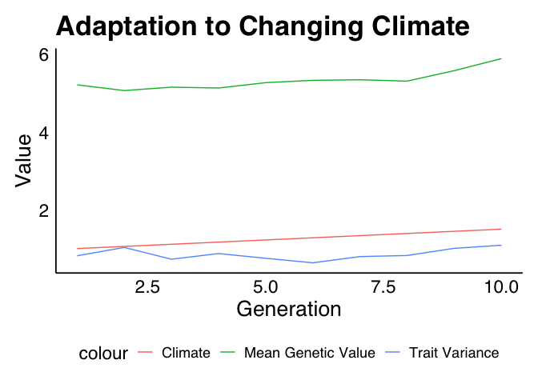

This workbook is mainly for simulating the genetic data for the IPM
project. The simulation is done using the AlphaSimR and landR packages.

    library(AlphaSimR)
    library(tidyverse)
    library(ggthemes)
    library(ggdoctheme)

# Create founder population

    founderPop = runMacs(
      nInd = 100,
      nChr = 10,
      segSites = 1000,
      inbred = TRUE,
      species = "GENERIC"
    )

# Define a simple genetic architecture for a trait influenced by environment

    SP = SimParam$new(founderPop)
    SP$addTraitAG(nQtlPerChr = 20, mean = 5, var = 2, varGxE =0.2)
    VarE = 0.4
    SP$setVarE(h2 = 0.5) # Heritability of 0.5

# Create initial population

    pop = newPop(founderPop, simParam = SP)

# Add environmental effect - simulate climate

    environmentalEffect = function(pop, climateVar) {
      n = pop@nInd
      # Climate effect proportional to individual's genetic value for adaptation
      effect = pop@gv * climateVar
      # Add environmental noise
      effect = effect + rnorm(n, 0, 0.5)
      return(effect)
    }

# Simulate multiple generations with changing environment

    results = list()
    climateTrend = seq(1, 1.5, length.out = 10) # Warming climate scenario

    for (gen in 1:10) {
      # Current climate variable
      currentClimate = climateTrend[gen]
      
      # Calculate fitness based on genetic value and environment
      pop = setPheno(pop, varE = VarE, reps = 1, simParam = SP)
      fitness = pop@pheno[,1]
      
      # Selection - individuals with higher fitness have higher probability of reproducing
      selectedIndices = sample(1:pop@nInd, 50, prob = fitness/sum(fitness))
      selectedPop = pop[selectedIndices]
      
      # Random mating
      pop = randCross(selectedPop, nCrosses = 100, nProgeny = 1, simParam = SP)
      
      # Store results
      results[[gen]] = data.frame(
        generation = gen,
        meanGV = mean(pop@gv),
        varGV = var(pop@gv),
        climate = currentClimate,
        fitness = mean(fitness)
      )
    }

# Visualize results

    # Convert results to data frame
    resultsDF = do.call(rbind, results)

    ggplot(resultsDF, aes(x = generation)) +
      geom_line(aes(y = meanGV, color = "Mean Genetic Value")) +
      geom_line(aes(y = climate, color = "Climate")) +
      geom_line(aes(y = Trait1, colour = "Trait Variance"))+
      labs(title = "Adaptation to Changing Climate",
           x = "Generation",
           y = "Value") +
      #scale_color_manual(values = c("Mean Genetic Value" = "blue", "Climate" = "red")) +
      theme_doc()

