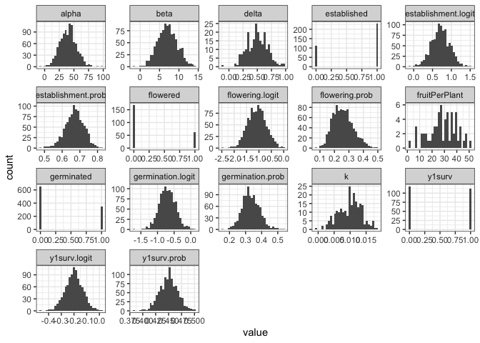
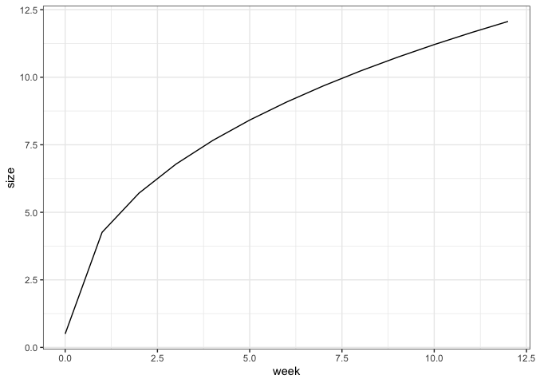

# Population Simulation Attempt

This code is mostly based off of Brandie QC's simulation code, and I am adding how to extract the genotype score and use it in the IPM model.

Suggested parameters from Julin:

-   1000 F2s (or just 1000 individuals)

    -   Done with runMacs

-   100 loci per trait with some kind of (expotnetial?) decay in effect
    size

    -   Use nQtlPerChr??

-   Traits:

    -   Germination

    -   Initial size

    -   Establishment

    -   Growth rate

    -   Flowering probability

        -   Ideally would depend on size... - do this through
            correlation matrix?

    -   Fruit per plant

        -   Ideally would depend on size...

    -   others?

Rishav demoed AlphaRSim:
<https://cran.r-project.org/web/packages/AlphaSimR/index.html>

-   Rishav's demo is on his GitHub:
    <https://github.com/rishavray/IPM_practice/blob/main/IPM_genetic_simulation.Rmd>

## Libraries


```r
library(AlphaSimR)
```

```
## Warning: package 'AlphaSimR' was built under R version 4.2.3
```

```
## Loading required package: R6
```

```r
library(tidyverse)
```

```
## Warning: package 'ggplot2' was built under R version 4.2.3
```

```
## Warning: package 'dplyr' was built under R version 4.2.3
```

```
## ── Attaching core tidyverse packages ──────────────────────── tidyverse 2.0.0 ──
## ✔ dplyr     1.1.4     ✔ readr     2.1.4
## ✔ forcats   1.0.0     ✔ stringr   1.5.0
## ✔ ggplot2   3.5.1     ✔ tibble    3.2.1
## ✔ lubridate 1.9.2     ✔ tidyr     1.3.0
## ✔ purrr     1.0.1
```

```
## ── Conflicts ────────────────────────────────────────── tidyverse_conflicts() ──
## ✖ dplyr::filter() masks stats::filter()
## ✖ dplyr::lag()    masks stats::lag()
## ✖ dplyr::mutate() masks AlphaSimR::mutate()
## ℹ Use the conflicted package (<http://conflicted.r-lib.org/>) to force all conflicts to become errors
```

```r
library(ggthemes)
logit <- brms::logit_scaled
inv_logit <- brms::inv_logit_scaled
```

## Create Founder Population


```r
founderPop = runMacs(
  nInd = 1000, #number of individuals to simulate 
  nChr = 10, #number of chromosomes to simulate - may not be important to match to Streps' 14
  segSites = NULL, #number of segregating sites to keep per chromosome.
  species = "GENERIC" #The GENERIC history is meant to be a reasonable all-purpose choice. It runs quickly and models a population with an effective populations size that has gone through several historic bottlenecks.
)
```

## Define Genetic Architecture for Traits


```r
SP <- SimParam$new(founderPop)
#Starts the process of building a new simulation by creating a new SimParam object and assigning a founder population to the class.

traitMeans <- c(germination.logit = logit(0.33), #logit to scale it (from gene --> trait)
                establishment.logit = logit(0.67),
                y1surv.logit = logit(0.45),
                alpha = 40, #Hmax = alpha -Sets the asymptote (max growth) for the Weibull model 
                beta = 7, #Hmin = beta -Changes the y intercept (the lower limit) for the Weibull model- recruit size?
                k = 0.01, #Often described as the growth rate --\> related to the slope of the line for the Weibull model 
                delta = 0.5, #Sets the inflection point - when you shift b/t concave to convex for the Weibull model 
                flowering.logit = logit(0.25),
                fruitPerPlant = 30)

SP$addTraitA(nQtlPerChr = 10, 
              mean = traitMeans, 
              var = (traitMeans*0.25)^2, #genetic CV = 0.25 (?)
              gamma = TRUE, #a lot of small effect loci and a few large effect loci 
              shape = 1, #shape parameter for gamma distribution 
              name=names(traitMeans))

SP$setVarE(h2=rep(0.5, length(traitMeans))) #set heritability to 0.5 
```

## Create Initial Population


```r
pop = newPop(founderPop, simParam = SP)
pop1 <- setPheno(pop)
```


```r
pheno <- pop1@pheno %>% as_tibble()
dim(pheno)
```

```
## [1] 1000    9
```

```r
head(pheno)
```

```
## # A tibble: 6 × 9
##   germination.logit establishment.logit y1surv.logit alpha  beta       k delta
##               <dbl>               <dbl>        <dbl> <dbl> <dbl>   <dbl> <dbl>
## 1            -0.779               0.373       -0.205  20.9  3.42 0.0135  0.404
## 2            -0.380               0.813       -0.160  36.1  9.14 0.00660 0.469
## 3            -0.236               0.676       -0.310  20.5  6.92 0.00608 0.132
## 4            -0.393               0.861       -0.179  52.2  6.21 0.00926 0.773
## 5            -0.511               0.440       -0.181  38.0  9.08 0.00820 0.509
## 6            -0.252               0.449       -0.201  39.7  6.41 0.0109  0.186
## # ℹ 2 more variables: flowering.logit <dbl>, fruitPerPlant <dbl>
```

### Convert pheno logits to probabilities and phenotypes

```r
pheno <- pheno %>%
  mutate(across(ends_with(".logit"), .fns = inv_logit, 
         .names = "{.col}.prob")) %>%
  rename_with(.fn = \(n) str_replace(n, "\\.logit\\.prob", "\\.prob")) %>%
  mutate(germinated = rbinom(n(), size=1, prob=germination.prob),
         established = ifelse(germinated, rbinom(n(), size=1, prob=establishment.prob), NA),
         beta, 
         alpha, 
         k = ifelse(established, k, NA), #can only have a growth rate if you establish
         delta = ifelse(established, delta, NA),
         y1surv = ifelse(established, rbinom(n(), size =1, prob=y1surv.prob), NA),
         flowered = ifelse(established, rbinom(n(), size = 1, prob = flowering.prob), NA),
         fruitPerPlant = ifelse(flowered, fruitPerPlant, NA))
```


```r
pheno %>%
  pivot_longer(everything()) %>%
  ggplot(aes(x=value)) +
  geom_histogram() +
  facet_wrap(~name, scales="free") +
  theme_bw()
```

```
## `stat_bin()` using `bins = 30`. Pick better value with `binwidth`.
```

```
## Warning: Removed 4670 rows containing non-finite outside the scale range
## (`stat_bin()`).
```

<!-- -->

## Try to get weekly growth data

### Model growth with the Weibull model


```r
weibull <- function (t, alpha, beta, k, delta) {
  result <- alpha - (alpha - beta) * exp(-(k * t)^delta)
  return(result)
}

##Example:
growth <- tibble(week = seq(0,12, 1)) %>%
  mutate(size = weibull(t = week,
                          alpha = 40, #Hmax = alpha -  Sets the asymptote (max growth)
                          beta = 0.5, #Hmin = beta - Changes the y intercept (the lower limit)
                          k = 0.01, #k - Often described as the growth rate --\> related to the slope of the line
                          delta = 0.5)) #delta - Sets the inflection point - when you shift b/t concave to convex

growth %>%  ggplot(aes(x=week, y=size)) +
  geom_line() +
  theme_bw()
```

<!-- -->

### Pheno weekly

```r
pheno_weekly <- pheno %>% 
  mutate(Indiv_ID=row_number()) %>% 
  slice(rep(1:n(), each = 12)) %>% #duplicate each row 12 times 
  group_by(Indiv_ID) %>% 
  mutate(week=row_number(), #12 weeks for each indiv
         week_next=lead(week, order_by = week), 
         elapsed_days= week_next - week, #interval length in days
         size = if_else(week==1, beta, #size in week 1 is the min size (beta)
                        weibull(t = week, #otherwise use the weibull formula to calculate size
                        alpha = alpha,
                        beta = beta,
                        k = k, 
                        delta = delta)))
pheno_weekly
```

```
## # A tibble: 12,000 × 22
## # Groups:   Indiv_ID [1,000]
##    germination.logit establishment.logit y1surv.logit alpha  beta     k delta
##                <dbl>               <dbl>        <dbl> <dbl> <dbl> <dbl> <dbl>
##  1            -0.779               0.373       -0.205  20.9  3.42    NA    NA
##  2            -0.779               0.373       -0.205  20.9  3.42    NA    NA
##  3            -0.779               0.373       -0.205  20.9  3.42    NA    NA
##  4            -0.779               0.373       -0.205  20.9  3.42    NA    NA
##  5            -0.779               0.373       -0.205  20.9  3.42    NA    NA
##  6            -0.779               0.373       -0.205  20.9  3.42    NA    NA
##  7            -0.779               0.373       -0.205  20.9  3.42    NA    NA
##  8            -0.779               0.373       -0.205  20.9  3.42    NA    NA
##  9            -0.779               0.373       -0.205  20.9  3.42    NA    NA
## 10            -0.779               0.373       -0.205  20.9  3.42    NA    NA
## # ℹ 11,990 more rows
## # ℹ 15 more variables: flowering.logit <dbl>, fruitPerPlant <dbl>,
## #   germination.prob <dbl>, establishment.prob <dbl>, y1surv.prob <dbl>,
## #   flowering.prob <dbl>, germinated <int>, established <int>, y1surv <int>,
## #   flowered <int>, Indiv_ID <int>, week <int>, week_next <int>,
## #   elapsed_days <int>, size <dbl>
```

## Extract genotype scores

```r
# Extract genotype scores for each individual
genotype_scores <- pop1@gv %>%
    as_tibble() %>%
    rownames_to_column(var = "Indiv_ID") %>%
    mutate(Indiv_ID = as.integer(Indiv_ID)) %>%
    select(Indiv_ID, everything())

# Join genotype scores with phenotypic data
pheno_weekly_merged <- pheno_weekly %>%
    left_join(genotype_scores, by = "Indiv_ID", suffix = c("_pheno", "_geno"))

pheno_weekly_merged |>
select(Indiv_ID, week, size, week_next, germination.logit_geno, germination.logit_pheno)
```

```
## # A tibble: 12,000 × 6
## # Groups:   Indiv_ID [1,000]
##    Indiv_ID  week  size week_next germination.logit_geno germination.logit_pheno
##       <int> <int> <dbl>     <int>                  <dbl>                   <dbl>
##  1        1     1  3.42         2                 -0.707                  -0.779
##  2        1     2 NA            3                 -0.707                  -0.779
##  3        1     3 NA            4                 -0.707                  -0.779
##  4        1     4 NA            5                 -0.707                  -0.779
##  5        1     5 NA            6                 -0.707                  -0.779
##  6        1     6 NA            7                 -0.707                  -0.779
##  7        1     7 NA            8                 -0.707                  -0.779
##  8        1     8 NA            9                 -0.707                  -0.779
##  9        1     9 NA           10                 -0.707                  -0.779
## 10        1    10 NA           11                 -0.707                  -0.779
## # ℹ 11,990 more rows
```
